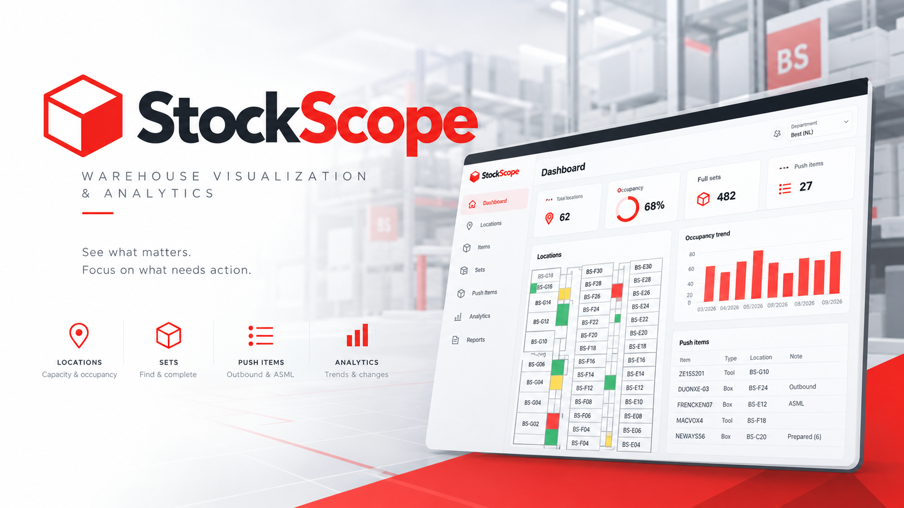

  

<strong>Warehouse stock visualization and analysis application.</strong>

---

## About StockScope

I work with warehouse stock every day and often see the same problem:

the data already exists, but getting a simple and useful answer from it can take too much time.

The goal of StockScope is not to replace, duplicate or compete with the existing warehouse management system.

StockScope works as an additional layer on top of the warehouse data that already exists.

Its purpose is to make that data easier to see, understand and use, and to help turn it into useful operational information.

---

# Architecture

StockScope is a warehouse stock visualization and analysis application.

I work with warehouse stock every day and often see the same problem: the data already exists, but getting a simple and useful answer from it can take too much time.

The goal of StockScope is not to replace, duplicate or compete with the existing warehouse management system.

StockScope should work as an additional layer on top of the warehouse data that already exists.

Its purpose is to make that data easier to see, understand and use, and to help turn it into useful operational information.

---

## Development Roadmap

StockScope will be developed in three main phases.

**Phase 1 – Warehouse Visual**

**Phase 2 – Warehouse Intelligence**

**Phase 3 – Advanced Capacity, History & AI**

Each phase should produce something useful on its own.

---

### Phase 1 – Warehouse Visual

#### Goal

The first version should turn the existing Location Report into a clear visual overview of the warehouse.

The warehouse layout is still changing, so StockScope should not depend on having final location dimensions or a final warehouse map before development can start.

---

#### Data Import

The first version can use the existing Location Report.

Data flow:

**Location Report → Excel Import → Data Adapter → StockScope Models → Application**

StockScope should work with its own internal models.

If API access becomes available later, Excel can be replaced by an API adapter without rebuilding the main application.

Future flow:

**HQ API → API Adapter → StockScope Models → Application**

---

#### Data Snapshots

StockScope should start preserving warehouse snapshots as early as possible.

Each imported report can represent the state of the warehouse at a specific point in time.

These snapshots do not need to provide advanced historical analytics in Phase 1.

The purpose is to start building historical data that can be used by later versions of StockScope.

Possible information to preserve includes:

- import date and time

- total number of objects

- objects per location

- article quantities

- statuses

- location occupancy

- Push Items

Starting this early prevents useful historical information from being lost before the historical analysis features are developed.

##### Historical Data Strategy

Each successfully confirmed Location Report import should preserve historical information at three levels:

1. Warehouse Snapshot Summary
2. Location Snapshots
3. Historical Import Data

The Warehouse Snapshot Summary contains:

- import timestamp
- overall warehouse occupancy
- total number of Items
- total number of active Reviews
- active Review counts by Review Reason

Location Snapshots preserve historical information for individual warehouse locations, including:

- location code
- occupancy
- item count
- active Review count

Historical Import Data preserves the warehouse records associated with the confirmed import, including Item H-codes, Articles, locations, levels and statuses.

The original confirmed Excel report should also be archived when technically and operationally permitted.

Historical records must remain independent from the current warehouse state and must not be overwritten by later imports.

All historical records created by one import should be associated with the same confirmed import.

Phase 1 uses Warehouse Snapshot Summaries and Location Snapshots for basic historical trends.

Detailed Item movement analysis, location turnover and advanced historical comparisons belong to later phases.

Failed, cancelled or unconfirmed imports must not create historical records.

---

#### Warehouse Overview

The Locations page provides a unified overview of warehouse locations.

In Phase 1, the Locations page uses a table-based List View.

The List View allows users to:

- search for locations
- filter locations by review reasons
- filter by occupancy range
- sort locations
- identify locations requiring attention
- open Location Detail

The Locations page also supports predefined filters when opened from the Dashboard or other application areas.

#### Future Visualization Modes

In later phases, the Locations page can support multiple visualization modes:

- List View
- Compact View
- Map View

**List View**

The standard table-based overview of warehouse locations introduced in Phase 1.

**Compact View**

A compact visual representation where locations are displayed as regularly arranged blocks.

Each block represents a warehouse location and can use colors or indicators to communicate occupancy, reviews and other important conditions.

**Map View**

A visual representation based on the actual physical warehouse layout.

Locations are positioned according to the warehouse map, allowing users to understand their physical arrangement and identify areas requiring attention.

All visualization modes should use the same underlying location data, filtering logic and review information.

Switching between views should not require separate location management systems.

Selecting a location from any visualization mode should open the same Location Detail.

Compact View and Map View are future enhancements and are not required for Phase 1.

---

#### Location Detail

A single warehouse location can contain multiple objects and multiple article types.

This is especially important for locations containing tools, where several different articles may be stored in the same location.

A location detail should therefore be able to show multiple stock records, including:

- object / H-code
- article
- status
- active reviews
- other relevant stock information

This makes it possible to move from seeing that a location has a problem to seeing exactly which objects or articles are causing it.

---

#### Manual Capacity

Until reliable location dimensions are available, maximum capacity can be configured manually.

For example:

**BS-F08 → Maximum 356**

If 302 objects are currently stored there, StockScope can calculate:

**302 / 356 → 84.8% occupied → 54 available**

The data model can already contain dimensions for future use even if they are not yet used in the calculation.

If a location does not have a reliable configured capacity, its occupancy should be displayed as unavailable rather than assumed to be 0%.

Capacity-based Reviews must not be generated for locations without a valid capacity.

These locations should remain visible in StockScope and can still contain Items and Item Reviews.

---

#### Status Visualization

Important or unusual statuses should be visible directly from the warehouse overview.

A location can show a small visual indicator when something inside requires attention.

Opening the location then shows the exact object and its status.

The purpose is to make exceptions easy to notice without filling the overview with unnecessary information.

---

#### Push Items

Push Items are identified through StockScope-owned Push Article configuration.

In Phase 1, the user manages a list of Articles that should be treated as Push Articles.

Each Push Article configuration contains:

- Article
- Push workflow type (ASML or Outbound)
- Expected sending day (optional, day of the week)
- Note (optional)
- Last changed date (automatic)

StockScope uses the current warehouse data to find individual H-code Items belonging to these Articles.

Matching Items are evaluated against their configured Push workflow rules and receive an active Push Item Review only when further action is required.

Push Item reviews are derived automatically and are not manually assigned to individual H-codes.

Push Articles can be managed through a modal on the Items page. Push Items are displayed using the Items page with a predefined filter, rather than a separate Push Items page.

The Push Article configuration is stored independently from imported Location Report data and must be preserved during future imports.

The expected sending day provides operational context and may influence the visual priority of Push Items. It does not create an additional Review Reason or turn StockScope into a planning system.

In Phase 2, Push Item detection can be extended using Article Relations and Set Rules, including combinations of Articles required to form complete sets.

---

#### Basic Stock Control

Phase 1 should already provide a simple Stock Control view based on information available from the imported warehouse data.

It should help identify:

- unexpected statuses

- locations requiring attention

- available Push Items

- other basic stock exceptions that can be detected directly from the current data

The purpose is to help the stock controller focus on exceptions instead of manually checking everything.

More advanced Stock Control functions that depend on relationships between boxes and tools will be added in Phase 2.

---

### Phase 2 – Warehouse Intelligence

#### Goal

Phase 2 should move StockScope from simply displaying warehouse data to understanding relationships inside that data.

---

#### Complete Sets

StockScope should understand which boxes and tools create a complete set.

Relations need to support:

- **ALL** – every defined item is required

- **ANY** – one item from a group is sufficient

- **ALL + ANY** – mandatory items and alternative groups can exist together

StockScope should calculate how many complete sets are currently available and show where their components are located.

The components do not need to be stored in the same location.

---

#### Quantity-Based Set Calculation

The warehouse data does not always tell us which specific tool is physically paired with which specific box.

For example:

**10 boxes + 5 compatible tools = 5 possible complete sets**

StockScope therefore needs to support calculations based on quantities, not only direct object-to-object relationships.

---

#### Find New Sets

StockScope should compare:

**Empty Boxes + Loose Tools + Set Definitions → Possible New Sets**

The user should be able to see:

- which sets can be created

- how many can be created

- required components

- available quantities

- locations of those components

---

#### Advanced Stock Control

Phase 2 should extend the basic Stock Control functionality with information calculated from relationships between warehouse items.

It should add:

- possible new sets

- incomplete sets

- missing set components

- other unusual conditions discovered through set and relationship analysis

The idea remains simple:

Instead of asking:

> **"What should I check?"**

StockScope should help answer:

> **"These are the things worth checking."**

---

#### Basic Historical Comparison

Because StockScope has already started preserving warehouse snapshots, Phase 2 can begin using this data for simple comparisons.

This could include:

- total stock growth or decline

- changes in object quantities

- changes in location occupancy

- new or removed objects

- basic location changes

- basic status changes

The purpose at this stage is not to build advanced analytics.

It is to start using the historical data that StockScope has already collected.

---

### Phase 3 – Advanced Capacity, History & AI

#### Computed Capacity

Once reliable location and object dimensions are available, manual capacity can be replaced or supplemented by calculated capacity.

The calculation can use:

- location width / length / height

- box width / length / height

- quantity

StockScope can then calculate physical occupancy and available space more accurately.

Until then, manual capacity from Phase 1 remains the fallback.

---

#### Advanced Historical Analysis

Because warehouse snapshots are collected from the earlier phases, StockScope can gradually build a history of how the warehouse changes over time.

Later versions can use this data to analyse:

- new or removed objects

- location changes

- status changes

- stock growth or decline

- occupancy changes

- frequently moved objects

- locations that are repeatedly emptied and filled

- boxes that have not moved for a long time

Some simple comparisons, such as total stock growth or decline, may already become available earlier.

Phase 3 should focus on deeper historical analysis, trends and patterns rather than beginning the collection of historical data.

---

#### Scan History and Activity Analysis

Future versions of StockScope should support importing Scan Report data from the existing warehouse system.

Scan Report data can provide individual scan events, including:

- Item H-code
- scan date and time
- scan user
- recorded location
- recorded status
- Article
- department
- related Article information, when available

This data should be stored separately from warehouse snapshots and linked to Items using their H-codes.

Future functionality may include:

- individual Item Scan History
- chronological scan timelines
- recorded location and status changes
- scan activity statistics by user and time period
- automatic detection of suspicious scan patterns
- identification of potential workflow or data inconsistencies

Scan activity statistics should provide operational insight rather than automatically measuring individual employee performance.

Scan Reports may not represent every physical movement or guarantee that every recorded scan completed successfully.

Phase 1 does not require Scan Report integration.

Scan History and activity analysis are future enhancements that should be considered when designing the StockScope data models and persistence architecture.

#### AI Suggester

AI should be added only after StockScope has reliable data and analytics.

The purpose is not simply to add a chatbot.

AI should use information already calculated by StockScope and provide useful suggestions such as:

> **"6 additional complete sets can currently be created."**

> **"BS-F08 is approaching its capacity."**

> **"These boxes have not moved for a long period."**

> **"These Push Items are currently available."**

The normal StockScope business logic should remain deterministic.

AI should sit on top of that information and help identify useful patterns and possible actions.

---

## Future Personal Project – Scanner UI Experiment

HQ Pack already has a company-wide Scanner integrated with its warehouse systems.

I do not want to replace or compete with it.

This would be a separate personal project where I could experiment with a modern scan-first warehouse workflow based on my own warehouse experience.

The default screen should always be ready for scanning while functions such as Stock Control, Batch Scanning or Search remain easily accessible.

After scanning an object, the scanner should immediately show:

- name / article

- status

- current location

- quantity in stock

- suggested location, when available

- note or warning

- available actions

- More Details

The basic principle would be:

**SCAN → SEE INFORMATION → ACT**

For a common location change:

**Scan Object → Show Info + Suggested Location → Scan Actual Location → Confirmation → Enter → Ready for Next Scan**

The suggested location is only guidance.

The worker still physically scans the actual destination location.

Other actions such as Change Status should be available immediately after scanning the object without requiring unnecessary navigation.

The interface should always clearly confirm what changed and then return directly to the ready-to-scan state.

As a small additional experiment, the time between the object scan and destination scan could also be used to estimate warehouse movement times.

This would remain a personal learning and portfolio project focused mainly on fast workflow and modern warehouse UI/UX.

---

## Expected Improvements

StockScope should not only make warehouse information easier to see.

Where possible, its impact should also be measurable.

Some expected improvements include:

- less time spent searching through reports

- faster identification of stock requiring attention

- faster access to location and object information

- easier identification of available Push Items

- faster understanding of warehouse occupancy

- less manual comparison of warehouse data

- faster identification of possible complete sets in later phases

Some of these improvements can be partially quantified.

For example, the time required to find specific information using the current workflow can be estimated and later compared with the same task performed using StockScope.

Historical warehouse reports can also be used as test data to compare how easily information can be extracted using the old workflow and StockScope.

Possible measurements could include:

- time required to find a specific object

- time required to inspect a location

- time required to identify an unexpected status

- time required to find available Push Items

- time required to determine warehouse occupancy

- time required to identify components for a complete set

The purpose is not to prove that every improvement can be reduced to a number.

The goal is to have a practical way to evaluate whether StockScope actually makes warehouse work faster and easier.

---

## Architecture Process

The development of StockScope follows eleven architectural steps:

1. **Business Analysis**

2. **User Flow**

3. **Data Models**

4. **Services & State**

5. **Components**

6. **Routing**

7. **Implementation**

8. **Validation**

9. **Testing**

10. **Data Flow Check**

11. **Deployment & Production**

The three phases describe **what StockScope will gradually become**.

The eleven architecture steps describe **how it will be designed and built**.

---

# 1. Business Analysis

## Why I Started StockScope

I work with warehouse stock every day and one problem I keep running into is that we have a lot of data, but getting a simple answer from that data can take too much time.

The information is there.

We know what boxes we have, where they are located and what they contain.

But when we need to make a decision, we often have to search through the system, filter data or export it to Excel and put the information together ourselves.

StockScope started as an idea to make this information easier to see and, more importantly, easier to use.

---

## Problems I Want to Solve

### How many complete sets do we have?

Knowing how many individual boxes we have is not always enough.

A product or shipment can require several different boxes or tools to create one complete set.

StockScope should automatically calculate how many complete sets can currently be created.

---

### Can we build a set from stock spread across different locations?

The parts needed for a set do not necessarily have to be stored together.

StockScope should answer:

> **Do we currently have everything needed to make the set, and where can I find it?**

---

### Where are our Push Items?

Push Items should be easy to find without searching through a large amount of stock data.

StockScope should show:

- what is available

- how much is available

- where it is located

- relevant status

- expected or planned sending day, when applicable

- useful operational notes

---

### What is stored in each location?

A warehouse location can contain multiple objects and multiple article types.

Selecting a location should immediately show its contents, quantities, statuses and other relevant stock information.

---

### How full is the warehouse?

StockScope should visualize location occupancy and available capacity.

Initially this can use manually configured capacity.

Later it can use physical location and object dimensions.

---

### What requires attention?

Instead of manually checking every location and every stock record, StockScope should help identify exceptions.

This can include:

- unexpected statuses

- locations requiring attention

- available Push Items

- other unusual stock conditions

Later versions can add more intelligent checks based on relationships between boxes, tools and complete sets.

---

## The First Goal

The first version of StockScope should answer simple practical questions:

- **What do we have?**
- **Where is it?**
- **What is inside this location?**
- **How full is this location?**
- **Is something here requiring attention?**
- **Which Push Items are available?**
- **How is overall warehouse occupancy changing over time?**
- **Is the total number of Items increasing or decreasing?**
- **How is the number of active Reviews changing over time?**

Later versions should also answer:

- **How many complete sets do we have?**
- **Can we create additional sets?**
- **Where are the required components?**
- **Which Items are frequently moved?**
- **Which locations have high turnover?**
- **Which Items have remained inactive for a long time?**

Phase 1 introduces basic historical trends using snapshots created after successfully confirmed Location Report imports.

More advanced historical analysis, including individual Item movements and long-term warehouse patterns, belongs to later phases.

The first step is simple:

> **Take the warehouse data we already have and turn it into information we can actually use.**

---

# 2. User Flow

The User Flow is currently focused on Phase 1.

The goal is to define how StockScope will be used during daily Stock Control work while keeping the application easy to extend in later phases.

## Main Flow

The Phase 1 flow starts with the Location Report.

**Location Report → Import → Validation → Preview → Compare → Confirm Import → Update Warehouse State → Reconcile Reviews → Create Snapshot → Dashboard**

The imported report is first validated and compared with the current warehouse state before it can replace the active data.

A new warehouse snapshot is created only after the import has been successfully confirmed.

This prevents invalid or suspicious report data from automatically becoming part of the warehouse history.

StockScope keeps its own application data, such as review states, review history and user actions, separately from the imported report.

---

## Dashboard

The Dashboard provides a quick overview of the current warehouse state.

The Phase 1 Dashboard includes:

- current warehouse occupancy
- number of Push Items
- number of Locations to Review
- latest successful import date and time
- Locations to Review overview
- occupancy trend
- Push Items overview
- quick access to import a new Location Report

The Dashboard always represents the warehouse state created by the latest successfully confirmed import.

If a new report is uploaded but fails validation or the import is cancelled before confirmation, the existing Dashboard data remains unchanged.

The Dashboard should show only the most useful information and provide navigation to more detailed views.

Some dashboard space can remain reserved for functionality introduced in later phases.

---

## Locations to Review

StockScope identifies locations that may require attention.

The Dashboard shows approximately the top 8 Locations to Review with a `View All` option.

A location can have multiple review reasons at the same time.

Phase 1 review reasons:

### Location-level

- **Low Occupancy** – occupancy ≤ 15%
- **Nearly Full** – occupancy ≥ 90% and < 100%
- **Full** – occupancy = 100%
- **Over Capacity** – occupancy > 100%

Capacity-related Review Reasons are mutually exclusive. A location should not receive multiple capacity Reviews for the same occupancy value.

### Item-level

- **Wrong Status** – an item has a status that does not match the expected storage status

- **Unexpected / Mixed Item** – an item does not match the expected content or rules of the location

- **Push Item** – an item that should not remain stored and should be moved further in the process

The exact occupancy thresholds are business rules and can be adjusted later.

Each review reason should have its own visual indicator, such as a small colored dot, so different reasons can be recognized quickly.

The `Locations to Review` count represents the number of unique locations with at least one active review, not the total number of individual reviews.

A single location can contain multiple active reviews while still counting as one Location to Review.

For example, if one location has an Over Capacity review and two item-level reviews, it still counts as one Location to Review while contributing three individual reviews to the total review count.

### Location Reviews vs. Item Reviews

Location Reviews describe conditions affecting the location as a whole.

Examples include:

- Low Occupancy
- Nearly Full
- Full
- Over Capacity

Item Reviews describe conditions affecting individual H-code Items.

Examples include:

- Wrong Status
- Unexpected / Mixed Item
- Push Item

An Item Review does not automatically create a separate Location Review.

However, a location containing one or more Items with active Reviews should still appear in Locations to Review.

Location Detail displays Location Reviews separately from Item Reviews.

The total active Review count for a location includes both types, without duplicating individual Review records.

This allows StockScope to identify locations requiring attention while preserving the distinction between location-level and item-level problems.

---

## Locations

The Locations page is the central place for browsing and reviewing warehouse locations.

StockScope uses one Locations page with different filter states instead of separate pages for different workflows.

The current filter and sorting state should be represented by query parameters.

Examples:

`/locations`

`/locations?status=review&sort=priority`

`/locations?status=handled`

This allows the same page to be opened from different parts of the application with the appropriate view already selected.

The page includes:

- reactive search by location code
- All, To Review and Handled views
- Review Reason filter
- minimum and maximum occupancy filter
- sorting
- location count

Review Reason filters should display the current number of matching locations.

Reasons with no current matches should remain visible but disabled.

Each location row should show:

- location code
- occupancy
- item count
- active reviews
- last checked

Hovering over the item count can provide a small preview of article names without opening the location.

Clicking a location opens the Location Detail page.

`Last Checked` represents the last time the location was physically inspected during Stock Control work.

A location can be marked as Checked independently from its review state.

For priority sorting, a location is ordered according to its highest-priority active review.

Current review priority from lowest to highest:

1. Low Occupancy
2. Nearly Full
3. Unexpected / Mixed Item
4. Wrong Status
5. Push Item
6. Full
7. Over Capacity

`View All` from the Dashboard's Locations to Review section opens the same Locations page with the To Review filter and priority sorting already applied.

Future versions may expand reactive search to find locations by article or barcode, for example `NEWAYS56`, `H343791` or `DUONXE-03`.

Future versions should also evaluate whether users should be able to manually add a location to review when an issue is discovered during physical Stock Control work.

---

## Location Detail

A Location Detail should display:

- location code
- current occupancy
- total number of Items
- active location-level reviews
- individual Items identified by their H-code
- Article associated with each Item
- current Item status
- active item-level reviews
- last physical check
- relevant location history

Location-level reviews should be displayed near the location overview, while item-level reviews should be displayed next to the affected Items.

Each Item can be opened in the Item Detail modal without leaving the Location Detail context.

### Location Overview

The top of the page provides a compact overview of the location.

It should include:

- location code
- current occupancy
- total number of items
- number of active reviews
- articles currently present at the location
- last physical check
- capacity, when available

The active review count includes both location-level and item-level active reviews.

The article overview can show the article name together with the number of items, for example:

`FRENCKEN07 (27) · NEWAYS56 (15)`

The header should remain compact so that the item list is visible without unnecessary scrolling.

### Location Reviews

Location-level reviews are displayed directly below the location overview.

Examples include:

- Low Occupancy
- Nearly Full
- Full
- Over Capacity

Each review can be handled individually using `Mark as Handled`.

If the location has no active location-level reviews, this section is not displayed.

Item-level reviews are not repeated in this section. They are displayed directly next to the affected item in the item list.

### Items

The Location Detail page displays all individual items currently stored at the location.

The list is not limited to a preview. If a location contains 8, 22 or 46 items, all items should be available directly on the Location Detail page.

Each item row should include:

- item ID / H-code
- article
- status
- active review, when applicable
- `Handle` action for an active item-level review

For example:

| ID      | Article    | Status   | Review       |
| ------- | ---------- | -------- | ------------ |
| H145784 | FRENCKEN07 | Storage  | —            |
| H145785 | FRENCKEN07 | Storage  | Push Item    |
| H145786 | NEWAYS56   | Cleaning | Wrong Status |

Item-level reviews such as `Wrong Status`, `Unexpected / Mixed Item` and `Push Item` are therefore shown directly in the context of the affected item.

### Item Filters

The item list can be filtered without leaving the Location Detail page.

Phase 1 should support:

- item ID search
- article filter
- status filter
- `All / Reviews only`

Articles available at the current location can be shown as selectable checkboxes with their item counts.

For example:

`☑ FRENCKEN07 (12)`

`☑ NEWAYS56 (7)`

`☑ DUONXE-03 (3)`

All articles are selected by default.

The user can select or deselect individual articles to quickly narrow the item list.

The page should show the number of currently displayed items, for example:

`Showing 7 of 22 items`

Filters should work together and update the visible item list without leaving the page.

### Items Page Integration

Location Detail provides the item functionality needed for working with one specific location.

A separate Items page will provide a broader view for searching and filtering items across the warehouse.

The user can open the current Location Detail item results in the Items page while preserving the relevant filter context.

For example:

`/items?location=BS-A04`

or:

`/items?location=BS-A04&article=NEWAYS56`

This allows the user to move from a location-focused workflow into a broader item-focused workflow without losing context.

### Related Articles and Sets

Phase 1 does not calculate complete sets.

However, the Location Detail design should remain compatible with future relations between articles.

For example, if `WETZLAR901` represents a box and `WETZLAR902` represents a related tool, both articles are displayed normally in Phase 1.

A later phase can use their relationship to provide information such as:

`5 complete sets · 15 empty boxes`

The future Items page should also be able to display multiple related articles together through filters.

### Mark as Checked

`Mark as Checked` represents a physical Stock Control inspection of the location.

When the user marks a location as checked:

- the `Last Checked` timestamp is updated
- the physical check is recorded in location history

Marking a location as checked does not automatically handle or resolve its active reviews.

`Checked` therefore represents a physical inspection of the location, while `Handled` represents an action taken on a specific review.

### Location History

The Location Detail page provides a compact history section.

Phase 1 should include a simple occupancy trend based on stored snapshots, for example:

`76% → 82% → 94% → 103%`

The page can also show recent activity such as:

- Over Capacity detected
- Location physically checked
- Wrong Status resolved

The goal is to provide useful recent context without turning the Location Detail page into a full analytics page.

More advanced historical analysis belongs to the dedicated Trends functionality and later development phases.

### Navigation

When a user opens Location Detail from a filtered Locations view, returning to Locations should preserve the previous context whenever possible.

For example:

`/locations?status=review&sort=priority`

→ `BS-A04`

→ Back to Locations

The user should return to the same filtered and sorted Locations view instead of being returned to the default `All Locations` view.

This allows Stock Control work to continue without repeatedly rebuilding the same filters.

---

## Item Detail

Selecting an individual H-code opens the Item Detail in a modal.

A separate Item Detail page is not required for Phase 1.

The modal allows the user to inspect a specific warehouse object without leaving the current page or losing the current filters, sorting or scroll position.

The same Item Detail modal can be opened from:

- Location Detail
- Items Page

Closing the modal returns the user to the same context from which it was opened.

### Item Information

Phase 1 should include:

- H-code
- article
- customer
- customer article number
- current location
- location level
- current status
- dimensions, when available
- Call Off information, when applicable
- active item-level reviews
- article relations

The Location Report already provides additional item information such as
customer article number, length, width, unit and kinds.

The `kinds` value does not need to be displayed directly.

When the imported `kinds` data identifies an item as belonging to a Call Off
list, StockScope should extract and display the relevant Call Off information.

For example:

`35 Call Off List ASML, RTM - Supplier Network`

can be displayed as:

`Call Off: ASML`

If no Call Off information is present, the field should not be displayed.

When dimensions are available, they should be displayed in a compact form.

Example:

`1.60 × 1.20 m`

In Phase 1, dimensions are informational.

Later phases can reuse the same data for more advanced capacity calculations.

### Relations

Relations are an important part of the Item Detail.

When relation data is available, StockScope should show the related article or articles directly in the modal.

Existing HQ data contains relation-related information such as `articleSet`. The exact relation model and available source data should be investigated during implementation.

In Phase 1, Article Relations should be displayed only when reliable relation data is available from an existing data source.

The Location Report alone may not provide enough information to identify these relationships.

If relation data is unavailable, the Relations section should remain hidden rather than displaying incomplete or assumed relationships.

Advanced relation logic and complete set calculations belong to Phase 2.

Phase 2 should extend Article Relations with:

- ALL / ANY requirements
- AND / OR combinations
- multiple related articles
- complete set calculations
- missing set components
- set availability analysis

### Item Reviews

Item-level reviews should be displayed directly in the Item Detail modal.

Examples include:

- Wrong Status
- Unexpected / Mixed Item
- Push Item

When a review has been addressed physically, the user can use:

`Mark as Handled`

Handled does not mean that StockScope has verified that the problem is resolved.

The review remains waiting for verification until a new warehouse report confirms whether the issue has disappeared or is still present.

### Article Image

An Article may optionally have an image that can be displayed when viewing an Item.

Because multiple physical Items can belong to the same Article, the image should be associated with the Article rather than with an individual H-code.

Article images are optional and are not required for Phase 1.

If a reliable image source becomes available later, the same Article image can be reused across all Items belonging to that Article.

### Future Item Data Integration

Future versions of StockScope should evaluate additional item information available from the existing HQ system.

Potential integrations include:

- Scan History
- additional article relation data
- existing article images
- associated documents such as work instructions

Future Scan History should provide item scan history where available, including:

- scan user
- previous scans
- status changes
- location movement

This could help answer who scanned an item, when it was scanned, where it was previously located and what its previous status was.

These additional integrations are not required for Phase 1.

Phase 1 should remain functional using the Location Report as its primary data source.

---

## Review Workflow

Reviews represent specific problems detected by StockScope.

A review is not automatically considered resolved when a user performs an action.

The basic review lifecycle is:

**OPEN → Mark as Handled → WAITING FOR VERIFICATION → RESOLVED**

A user can mark an individual review as `Handled`.

This means that the user has taken action on the specific problem, but StockScope still needs to verify the result using new warehouse data.

The action is stored by StockScope and is not overwritten by a new Excel import.

After the next successfully confirmed import, StockScope evaluates the review condition again.

If the problem no longer exists:

**WAITING FOR VERIFICATION → RESOLVED**

If the problem is still detected:

**WAITING FOR VERIFICATION → OPEN**

A review can also become resolved without being manually handled.

Normal warehouse activity can remove the condition that originally created the review.

In this case:

**OPEN → RESOLVED**

For example, a Low Occupancy review may disappear because additional items were moved into the location during normal warehouse activity.

A Push Item review may disappear because the item was moved out of the warehouse before anyone manually marked the review as Handled.

In these situations, the review history should record that the problem was resolved by a warehouse data change rather than by a user action.

Reviews belong to the specific problem, not automatically to the entire location.

This allows one location to contain several independent reviews with different states.

### Push Item Verification

Push Item Reviews should be resolved according to the warehouse workflow associated with the Push Article.

Different Push Article types may have different completion conditions.

**ASML Push Items**

The expected completion workflow for ASML Push Items is:

- Status: Transfer to ASML
- Location: EXTERN-NL-EIN-01

However, Items transferred to this external location are not visible in the currently available Location Report or Scan Report.

StockScope therefore cannot directly verify the final transfer status or destination using these reports.

When an ASML Push Item is no longer present in the monitored warehouse data after a successfully confirmed import, its active Push Item Review can become RESOLVED.

The resolution reason should indicate that the Item is no longer present in the monitored warehouse, rather than claiming that the transfer to ASML was directly verified.

An Item may later return from ASML and appear in the warehouse again.

If the returning Item still matches the active Push Article configuration and requires attention, StockScope should create a new active Push Item Review while preserving the previous Review History.

**Outbound Push Items**

An Outbound Push Item is considered completed when its location becomes:

- Location: Transfer to lbOutbound
- Status: Any

The location is the relevant completion condition for this workflow.

A location such as `Transferred to LB Outbound` is part of the normal warehouse workflow and must not automatically generate a Review.

For an Item that is not configured as an Outbound Push Item, this location does not represent an error.

For an Outbound Push Item, reaching the configured outbound transfer location is considered a completion condition.

Review detection must consider the Item's Article, configured Push workflow type, current location and relevant business rules.

**Review Lifecycle**

Mark as Handled records a user action but does not automatically resolve the Push Item Review.

StockScope evaluates the configured completion rules after each successfully confirmed import.

When the completion condition is confirmed, the Review becomes RESOLVED.

When the Item remains in the warehouse without meeting its completion condition, the Review remains active or returns to OPEN after verification.

Push Article configuration should support different workflow types and completion rules.

More advanced Push Rules based on Article Relations and complete sets remain part of Phase 2.

### Wrong Status Context

A `Wrong Status` review must not be created based on the item status alone.

The status must be evaluated together with the item's current location and the relevant warehouse business rules.

For example:

**Status: AfterCleaning + Location: Transfer to BS → No Wrong Status review**

An item in `Transfer to BS` can already be included in the BS Location Report while still being in transit and not yet physically stored in a warehouse location.

However:

**Status: AfterCleaning + Location: BS-A03 → Wrong Status review**

Once the item has been received into a normal BS warehouse location, the same status may no longer be valid for storage.

The Review Engine should therefore evaluate the combination of location, status and business rules rather than treating a status as universally correct or incorrect.

---

## Items

Items will have their own main page accessible from the sidebar.

The Items page provides a global view of individual warehouse objects across all locations.

Each row represents one specific H-code.

The page should make it possible to find individual objects and compare items across multiple articles, locations, statuses and review states without navigating through individual locations first.

### Search

The Items page should provide a single reactive search field.

Phase 1 search should support:

- H-code
- article
- customer article number

Examples:

`H398913`

`ZEISS022`

`4022.674.1152x`

### Filters

The Items page should support multi-select filtering.

Phase 1 filters include:

- Article
- Location
- Status
- Review
- Size
- Call Off

Multiple values can be selected within the same filter.

Values inside one filter group use OR logic.

Different filter groups are combined using AND logic.

Example:

`(ZEISS021 OR ZEISS022) AND (BS-A01 OR BS-A04) AND Storage AND Large`

Active filters should remain visible and can be removed individually.

A `Clear All` action resets all active filters.

The page should also show how many items match the current filters.

Example:

`Showing 37 of 4,382 items`

### Size Filter

Size is an Article property.

The Location Report already provides:

- length
- width
- unit

Phase 1 should provide simple size filters:

- Small
- Medium
- Large

The exact boundaries between these categories should not be defined until the real article dimension data has been analyzed.

This avoids creating arbitrary size rules before understanding the actual warehouse data.

### Call Off

Call Off is an Article property rather than a property of an individual H-code.

When an Article belongs to a Call Off list, a small visual indicator should be displayed next to the Article in the Items table.

The indicator can provide additional information on hover.

Example:

`Call Off: ASML`

Call Off should also be available as a filter.

Selecting a Call Off filter shows all H-codes whose Article belongs to the selected Call Off.

A separate Call Off table column is not required.

### Items Table

Each table row represents one individual warehouse object.

Phase 1 should show:

- H-code
- article
- customer article number
- location
- status
- active review indicator

Selecting the H-code or item row opens the Item Detail modal.

Closing the modal returns the user to the same Items page context without losing filters, sorting or scroll position.

### Location Preview

The Location value in an item row should provide a quick preview on hover.

The preview can include:

- occupancy
- number of items
- number of active reviews
- last checked
- article counts

The preview is informational only and should not contain editing or review actions.

Selecting the Location opens its Location Detail page.

### Query Parameters

The Items page should use query parameters to represent filters and sorting where appropriate.

Examples:

`/items`

`/items?location=BS-A04`

`/items?location=BS-A04&article=NEWAYS56`

`/items?status=storage`

This allows other parts of StockScope to open the same Items page with useful filters already applied.

For example, `Open in Items Page` from Location Detail can open:

`/items?location=BS-A04`

The same Items page is therefore reused instead of creating separate pages for different item views.

### Article and Item Data

StockScope should distinguish between information belonging to an Article and information belonging to an individual warehouse object.

Article-level information can include:

- customer article number
- size
- Call Off
- relations
- image, when available

Individual H-code information can include:

- location
- level
- status
- active reviews

This distinction should be reflected later in the StockScope data models.

---

## Push Items

Push Items will not have a separate page in Phase 1.

The existing Items page will be reused with a Push Items quick filter.

This keeps the workflow simple and avoids duplicating item search, filtering and table functionality.

### Push Item Definition

In Phase 1, Push Items are identified using StockScope-owned Push Article configuration.

Each Push Article defines:

- Article
- Push workflow type (ASML or Outbound)
- optional expected sending day
- optional note

StockScope identifies H-code Items belonging to configured Push Articles and evaluates their current warehouse state against the corresponding workflow rules.

An Item receives an active Push Item Review only when it still requires attention according to its configured workflow.

An Outbound Push Item that has reached its configured transfer location should not remain an active Push Item Review.

An ASML Push Item that disappears from the monitored warehouse data can have its Review resolved with the reason that it is no longer present in the monitored warehouse.

This does not prove that its final transfer to ASML was directly verified.

Push Article configuration remains independent from imported Location Report data and must be preserved during future imports.

Future Push Rules can use Article Relations and Set Intelligence in Phase 2.

### Push Items Filter

The Items page should provide a quick filter for active Push Item Reviews.

Selecting this filter shows individual H-code Items that currently require attention according to their configured Push workflow.

Items whose Push Item Reviews have already been resolved are not included in the active Push Items filter.

The Dashboard Push Items count and View All action should use the same active Push Item Review definition.

Example:

`/items?review=push-item`

The existing Items page filters remain available while the Push Items filter is active.

### Push Articles

In Phase 1, Push Item configuration belongs to the Article rather than to an individual H-code.

If an Article is configured as a Push Article, all individual H-codes belonging to that Article can be identified as Push Items.

Example:

`ICHOR06 → Push Article`

All H-codes with Article `ICHOR06` can therefore appear in the Push Items view.

This avoids manually configuring individual warehouse objects.

### Manage Push Articles

Push Articles should be managed through a modal opened from the Items page.

The modal provides a simple editable list of configured Push Articles.

Each entry can contain:

- Article
- Push workflow type (ASML or Outbound)
- expected sending day
- note
- last changed

Users should be able to:

- add a Push Article
- edit a Push Article
- remove a Push Article

A separate Push Items management page is not required.

### Expected Sending Day

Expected Sending Day represents an expected day of the week rather than a specific calendar date.

Examples:

- Monday
- Wednesday
- Friday

The field is optional because not every Push Article needs a regular sending day.

When an expected sending day is configured, StockScope can visually highlight Push Items when the sending day is approaching.

For example:

- one day before → sending soon
- expected sending day → expected today

This should be a visual priority indicator rather than a separate Review Reason.

The exact icon and visual styling can be decided during UI implementation.

### Notes

Each Push Article can optionally contain a short operational note.

Examples could include destination, priority or other useful context.

The note should provide operational information without turning StockScope into a planning system.

### Last Changed

StockScope should record when the Push Article configuration was last changed.

This makes it possible to understand how current the manually maintained Push Item information is.

### StockScope Business Data

Push Article configuration is StockScope-managed business data.

It should be stored independently from imported warehouse reports.

The Location Report describes the current physical warehouse state, including which H-codes and Articles exist and where they are located.

StockScope separately maintains information such as:

- whether an Article is a Push Article
- Push workflow type (ASML or Outbound)
- expected sending day
- note
- last changed

Importing a new Location Report should therefore not remove the Push Article configuration.

### Future Push Rules

Phase 1 uses a deliberately simple rule:

`Article → Push Article`

Future versions can extend this using Article Relations and Set Intelligence.

For example, a future Push Rule could require:

`ICHOR06 AND ICHOR07 → Complete Set → Push`

More advanced rules can later use the existing AND / OR relation logic.

This belongs to Phase 2 Warehouse Intelligence and should not complicate the Phase 1 Push Items workflow.

---

## Review History

StockScope keeps review actions and results in its own application data.

This allows the application to remember that a review was previously handled even after another Location Report is imported.

A simple history can record events such as:

- review detected

- marked as handled

- verified as resolved

- detected again

Resolved reviews no longer need to appear in the active Locations to Review list but remain available in history.

---

## Snapshots

Each successful Location Report import can create a warehouse snapshot.

A snapshot represents the warehouse state at a specific point in time.

Multiple snapshots can exist during the same day.

For example:

08:00 → Snapshot  
12:00 → Snapshot  
16:00 → Snapshot

All snapshots can remain stored.

For simple daily trends, StockScope uses:

- the latest available snapshot for the current day
- the final snapshot of previous days

This allows StockScope to preserve detailed import history while keeping the Phase 1 Trends view simple.

### Snapshot Data

A snapshot should preserve enough information to support Phase 1 historical trends.

This includes:

- timestamp
- warehouse occupancy
- total item count
- total active review count
- active review counts by Review Reason

Review counts should include both Location Reviews and Item Reviews.

Location Reviews:

- Low Occupancy
- Nearly Full
- Full
- Over Capacity

Item Reviews:

- Wrong Status
- Unexpected / Mixed Item
- Push Item

Historical snapshot values should not be recalculated when the current warehouse state changes.

A snapshot represents what StockScope detected at that point in time.

For example:

Monday:

`Push Items: 14`

Tuesday:

`Push Items: 9`

Even if some of Monday's Push Item reviews are later resolved, the Monday snapshot should still preserve the historical value of 14.

---

## Trends

The Trends page provides a simple historical overview of how the warehouse changes over time.

Phase 1 focuses on three main trends:

- Warehouse Occupancy
- Total Items
- Reviews

The goal is to provide useful operational history without turning Phase 1 into a complex analytics system.

### Time Period

Users should be able to change the displayed period.

Initial options can include:

- 7 days
- 30 days
- 90 days

### Warehouse Occupancy

Warehouse Occupancy shows how the overall warehouse occupancy changes over time.

The chart uses historical snapshot data.

For example:

`61% → 64% → 63% → 67% → 68%`

The page can also show:

- current value
- value at the beginning of the selected period
- change over the selected period

### Total Items

Total Items shows how the total number of individual warehouse objects changes over time.

Each concrete H-code counts as one item.

For example:

`4,210 → 4,238 → 4,301 → 4,276 → 4,382`

This provides a simple indication of whether the physical stock in the warehouse is increasing or decreasing.

### Reviews

The Reviews trend shows the number of active reviews recorded in each snapshot.

It includes both Location Reviews and Item Reviews.

Location Reviews include:

- Low Occupancy
- Nearly Full
- Full
- Over Capacity

Item Reviews include:

- Wrong Status
- Unexpected / Mixed Item
- Push Item

Users should be able to filter the Reviews trend by Review Reason.

Multiple Review Reasons can be selected when useful.

For example, selecting only `Push Item` shows the historical number of active Push Item reviews.

Selecting multiple reasons shows the combined trend for the selected Review Reasons.

### Handled and Resolved Reviews

`Handled` and `Resolved` represent different events.

`Handled` means that a user explicitly indicated that they addressed a review.

`Resolved` means that the review condition no longer exists according to newer warehouse data.

A review does not need to be manually marked as Handled before it can become Resolved.

For example, a location can have Low Occupancy in one snapshot.

No user marks the review as Handled.

Later warehouse activity fills the location.

The next report no longer meets the Low Occupancy condition.

The review can therefore become:

`Resolved by warehouse data change`

The same principle applies to Item Reviews.

For example, if a Push Item is present in one report but is no longer in the warehouse in the next report, its review can become Resolved automatically.

The historical snapshot still preserves that the Push Item existed previously.

### Review Verification

A review marked as Handled should remain waiting for verification until newer warehouse data is available.

The normal flow can be:

`OPEN → Mark as Handled → WAITING FOR VERIFICATION → RESOLVED`

If the condition is still present after the next import, the review can become active again.

Reviews can also follow:

`OPEN → RESOLVED`

when the condition disappears through normal warehouse activity without a manual Handled action.

This distinction allows StockScope to separate user actions from changes detected directly in warehouse data.

### Dashboard Integration

A small trend overview can be displayed on the Dashboard.

Selecting `View Trends` opens the dedicated Trends page.

The full Trends page provides the longer historical view and filtering options.

### Future Analytics

More advanced warehouse analytics are outside the Phase 1 Trends scope.

Future versions can evaluate metrics such as:

- frequently moved items
- location churn
- long-term inactive items
- article growth
- set trends
- capacity trends
- AI-assisted warehouse insights

---

## Import Data

The Import Data page allows the user to import the latest Location Report into StockScope.

The import process should be simple, but it must also protect the application from incorrect or incomplete warehouse data.

A technically valid Excel file can still contain unrealistic or incorrect data.

For this reason, StockScope should not update the warehouse state immediately after a file is selected.

The Phase 1 import flow is:

`Select File → Validate → Process Preview → Compare → Confirm Import → Update Warehouse State → Reconcile Reviews → Create Snapshot → Import Complete`

### Select File

The user can select or drag and drop a Location Report.

Phase 1 expects the existing Location Report in `.xlsx` format.

The page can also display information about the latest successful import, including:

- import date and time
- number of locations
- number of items

### File Validation

StockScope should validate the file before allowing an import.

The initial validation should verify that:

- the file can be read
- the file is a supported Excel file
- the expected Location Report structure exists
- required columns are present

If required data or columns are missing, the import should be blocked.

For example:

`Missing required column: location`

In this situation, `Confirm Import` should not be available.

### Import Preview

A valid file should first be processed as a preview.

Processing the preview must not modify the persistent StockScope state.

No snapshot should be created and no existing warehouse data or reviews should be changed at this stage.

The preview should show the most important values from the new report and compare them with the current warehouse state.

For example:

| Metric    | Current | New Report | Change |
| --------- | ------: | ---------: | -----: |
| Locations |     184 |        184 |      0 |
| Items     |   4,345 |      4,382 |    +37 |
| Occupancy |     66% |        68% |    +2% |
| Reviews   |      27 |         21 |     -6 |

This gives the user an opportunity to verify that the new report looks reasonable before it becomes part of StockScope history.

### Import Warnings

StockScope should detect unusually large changes when possible.

For example:

- extremely large decrease in item count
- occupancy unexpectedly dropping close to zero
- unusually large change in the number of locations
- other major differences compared with the current warehouse state

A warning means that the report is technically valid but the data change looks unusual.

For example:

`Item count decreased by 99.5%.`

`Warehouse occupancy decreased from 66% to 0%.`

The user should be asked to verify that the correct Location Report was selected.

Warnings should not automatically block the import because a large warehouse change can still be legitimate.

The user can still choose `Confirm Import`.

### Errors and Warnings

Errors and warnings represent different situations.

An `Error` means that StockScope cannot reliably process the report.

The import must be blocked.

A `Warning` means that the report can be processed, but the resulting warehouse state looks unusual.

The user can still confirm the import after reviewing the preview.

### Confirm Import

Only `Confirm Import` should allow the preview data to become part of the persistent StockScope state.

If the user cancels the preview:

- the current warehouse state remains unchanged
- no reviews are changed
- no snapshot is created
- no historical trend data is affected

This prevents an accidentally selected or incorrect report from contaminating warehouse history.

A confirmed import must be processed as one consistent operation.

Updating the warehouse state, reconciling Reviews and saving historical records must either complete successfully together or leave the previously confirmed state unchanged.

A partially completed import must not become the active warehouse state.

Repeated imports of the same report should be detected to prevent accidental duplicate historical records.

### Update Warehouse State

After confirmation, the Location Report is processed through the StockScope data adapter and converted into the internal StockScope models.

The confirmed import updates the current warehouse state.

This includes warehouse-derived data such as:

- locations
- items
- statuses
- occupancy
- other values derived from the Location Report

The import should update warehouse data without deleting StockScope-specific application data.

The following StockScope data should remain persistent across imports:

- Push Article configuration
- Handled review actions
- Last Checked information
- Review History
- user notes
- historical snapshots

### Review Reconciliation

After the warehouse state is updated, StockScope should evaluate the Review rules against the new data.

This can result in:

- new reviews being detected
- existing reviews remaining open
- Handled reviews being verified
- reviews becoming Resolved when their condition no longer exists

A review does not need to be manually marked as Handled before it can become Resolved.

For example, if a Push Item existed in the previous report but is no longer present in the new warehouse data, the review can become:

`Resolved by warehouse data change`

The same principle applies to Location Reviews.

For example, a Low Occupancy review can become Resolved when normal warehouse activity fills the location before the next report.

### Missing Item Verification

An Item missing from a new Location Report must not automatically be considered transferred or resolved unless the report is confirmed to cover the expected warehouse scope.

StockScope should distinguish between:

- an Item no longer present in a complete warehouse report
- an Item missing because the imported report covers only part of the warehouse

If report coverage cannot be verified, missing Items should not automatically trigger final Push Item resolution.

The import preview should warn users when report coverage appears incomplete or inconsistent with previous imports.

### Review Business Rules

Review detection can depend on more than one imported value.

For example, Wrong Status should consider both the item's status and its warehouse location.

An item with:

`AfterCleaning + Transfer to BS`

should not automatically create a Wrong Status review.

The item can already be included in the Best Location Report while still being part of the incoming transfer process.

However:

`AfterCleaning + real BS storage location`

can create a Wrong Status review when that status is not valid for storage at the location.

The exact combinations of valid locations and statuses should be defined later as Review Engine business rules.

### Create Snapshot

A new warehouse snapshot should be created only after a successful confirmed import.

The snapshot preserves the warehouse state required by Phase 1 Trends.

This includes values such as:

- warehouse occupancy
- total item count
- total active review count
- active review counts by Review Reason
- snapshot timestamp

Cancelled previews and failed imports must not create snapshots.

### Import Complete

After a successful import, StockScope should display a short summary.

For example:

`184 Locations`

`4,382 Items`

`21 Reviews`

`68% Warehouse Occupancy`

The summary can also show changes compared with the previous snapshot.

For example:

`Items: +37`

`Reviews: -6`

`Occupancy: +2%`

The user can then return to the Dashboard.

### Phase 1 Scope

Phase 1 should focus on preventing incorrect data from entering StockScope rather than providing advanced tools for repairing warehouse history afterward.

The main protection is:

`Validate → Preview → Compare → Confirm`

Advanced snapshot management or manual historical data repair can be evaluated in later development phases.

---

## Phase 1 Navigation

The initial main navigation is:

- Dashboard
- Locations
- Items
- Trends
- Import Data

Push Items do not require a separate main navigation entry in Phase 1.

They are accessed through the Items page using the Push Item filter.

For example, selecting `View All` from the Push Items section on the Dashboard opens the Items page with the Push Item filter already applied.

The navigation should remain simple and can be extended when functionality from later phases is introduced.

---

## Phase 1 User Flow

The Phase 1 User Flow connects the main StockScope functions into one daily workflow.

The process starts with importing the latest Location Report.

**Location Report → Import → Validation → Preview → Compare → Confirm Import → Update Warehouse State → Reconcile Reviews → Create Snapshot → Dashboard**

After a successful import, the Dashboard becomes the main starting point for working with the current warehouse state.

From the Dashboard, the user can continue through three main areas:

**Dashboard → Locations**

The Locations page provides the warehouse overview and allows the user to find locations that require attention.

**Locations → Location Detail → Item Detail Modal**

Location Detail shows the current contents of the location, its occupancy, active reviews and history.

Individual H-code items can be inspected through the Item Detail modal without leaving the Location Detail context.

**Dashboard → Items**

The Items page provides access to individual H-code objects across the warehouse.

Items can be searched and filtered by properties such as article, location, status, review reason, size and Call Off.

Selecting an item opens the same Item Detail modal used from Location Detail.

Push Items are accessed through the Items page using the Push Item filter rather than through a separate page.

**Dashboard → Trends**

The Trends page uses historical snapshots to show basic changes in warehouse occupancy, total items and reviews over time.

Reviews connect the Locations and Items workflows.

StockScope detects review conditions from the current warehouse data.

A user can inspect the affected location or item and mark a specific review as `Handled`.

**OPEN → Mark as Handled → WAITING FOR VERIFICATION**

The next successfully confirmed import evaluates the review condition again.

If the problem no longer exists:

**WAITING FOR VERIFICATION → RESOLVED**

If the problem still exists:

**WAITING FOR VERIFICATION → OPEN**

A review can also be resolved directly by normal warehouse activity:

**OPEN → RESOLVED**

Review history remains stored by StockScope regardless of whether the problem was resolved through a user action or through a warehouse data change.

The complete Phase 1 workflow can therefore be summarized as:

**Import Data → Dashboard → Locations / Items / Trends → Location or Item Detail → Review Action → Next Import → Review Reconciliation → Snapshot → Updated Dashboard**

---

# 3. Data Models

---

# 4. Services & State

---

# 5. Components

## UI Design System

StockScope should use a small and consistent design system instead of styling individual components independently.

The design system should eventually define reusable rules for:

- spacing

- typography

- colors

- status indicators

- buttons

- cards

- tables

- location blocks

- warnings

- responsive layout

Reusable Angular components and shared design tokens should be preferred over repeating component-specific CSS.

The specific styling technology does not need to be decided yet.

---

# 6. Routing

---

# 7. Implementation

---

# 8. Validation

---

# 9. Testing

---

# 10. Data Flow Check

---

# 11. Deployment & Production

---

# Personal Notes

## What is a Data Adapter?

A Data Adapter is a layer between external data and the internal StockScope models.

For example, the Location Report may contain data using names, columns and structures defined by the existing warehouse system.

StockScope should not make the whole application depend directly on that structure.

Instead:

**Location Report → Excel Import → Data Adapter → StockScope Models → Application**

The Data Adapter reads the imported warehouse data and translates it into the internal structure expected by StockScope.

For example:

**External Excel data**

`Location = BS-F08`

`Article Description = NEWAYS56`

`Qty = 6`

can be transformed into a StockScope object with properties defined by our own models.

The rest of the application then works with the StockScope model instead of directly with the Excel structure.

---

## What is an API Adapter?

An API Adapter has the same responsibility.

The difference is the source of the data.

Instead of receiving data from an imported Excel report:

**HQ API → API Adapter → StockScope Models → Application**

The API Adapter translates the data returned by the API into the same StockScope models.

This means the main application does not need to care whether the data originally came from Excel or an API.

Today:

**Excel → Data Adapter → StockScope**

Later:

**API → API Adapter → StockScope**

The source changes.

The StockScope application does not need to be rebuilt around a completely different data structure.

That is the main reason for having the adapter layer.
